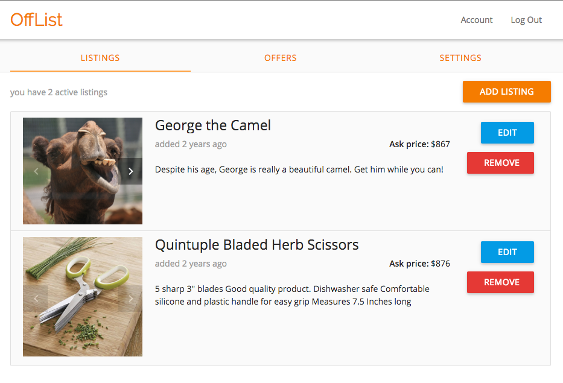

# OffList

[Live][heroku]

[heroku]: http://www.off-list.com

OffList is a full-stack web application inspired by Craigslist.  It utilizes Ruby on Rails on the backend, a PostgreSQL database, and React.js with a Flux architectural framework on the frontend.  

## Features & Implementation

### Single-Page App

OffList is truly a single-page; all content is delivered on one static page.  The root page listens to a `SessionStore` and renders content based on a call to `SessionStore.currentUser()`.  Sensitive information is kept out of the frontend of the app by making an API call to `SessionsController#get_user`.

### Listings

Users can manage listings and offers in their account settings.



### Location

Listing location was implemented with the Google Maps API. The goal was to create a 2-way sync between the data on the page and what appears on the map.

  In the listing edit form, users can either enter an address in the address field or select a location on the map. Entering data in one will update the other.

  On the listing search, users can either select an address or position on the map to run a search.

Location is stored as a coordinate pair in the database. When pulling a listing from the backend, the address that appears is the address as determined by Google's address lookup API. This implementation meant there was a lower likelihood of a mismatch between the address and location, and ensures a valid address. However, it also means that what appears on a user's listing may not exactly match what they had originally entered when creating the listing. Accuracy and maintainability were the priority in this implementation decision.

### Search

Search is written as a single SQL query using ActiveRecord query methods. It accepts an options hash with sensible defaults. The search will match an arbitrary number of keywords. Search results are ranked by the number of matching keywords.

`Listing` score method:

```ruby
def self.score(opts={})
  defaults = { "query" => '', "bounds" => nil, "active" => true}
  opts = (opts ? defaults.merge(opts) : defaults)

  filtered_result = Product.where(active: opts["active"])
                           .in_bounds(opts["bounds"])

  if opts["query"].empty?
    return filtered_result.select(:id)
                          .order('count_id desc')
                          .group(:id)
                          .count(:id)
  end


  keywords = opts["query"].split(' ')
  result = filtered_result.search_by_keyword(keywords.shift)

  until keywords.empty?
    result = result.union_all(filtered_result.search_by_keyword(keywords.shift))
  end

  result.select("products.id")
        .order('count_products_id desc')
        .group("products.id")
        .count("products.id")
end
```

The search will also return all results within the current map bounds. The search will update results each time a user moves the map (the search is not run if the map moves as a result of an info window).

On the front end, results are split into 2 groups: results within the radius of the initial search and results that are within the bounds of the map, but not inside the search radius (if a search radius and location are provided).
